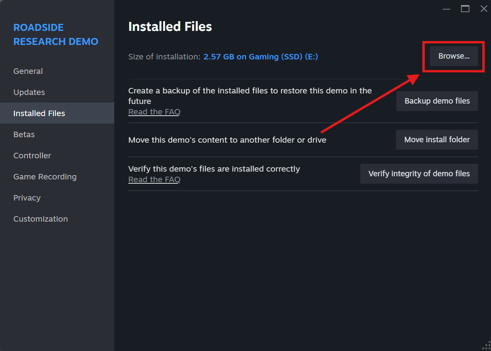
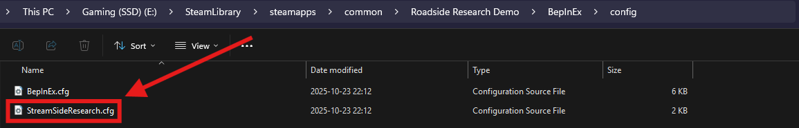

# StreamSideResearch

StreamSideResearch is a BepInEx Unity mod for the Steam game (demo), [Roadside Research](https://store.steampowered.com/app/3911640/Roadside_Research_Demo/).

Its primary focus is on Twitch streamers who wish to add an element of interactivity with their audience, by allowing Twitch chatters to appear in the game, either as agents or customers.

> [!Note]
> If you are a user that just cares about the mod and not how it was developed, feel free to skip the “How It Works” section, unless that sounds of interest to you!

## Table of Contents

* [Prerequisites](#prerequisites)
* [Getting Started](#getting-started)
* [Configuration](#configuration)
* [Questions?](#questions)

## Prerequisites

* [Roadside Research Demo](https://store.steampowered.com/app/3911640/Roadside_Research_Demo/)
* [BepInEx Stable (not Bleeding Edge)](https://docs.bepinex.dev/articles/user_guide/installation/index.html)

## Getting Started

Before installing the mod, [install BepInEx](#prerequisites) for Roadside Research and run the game. Once the game loads and the main menu appears, close the game.

Download the latest version of StreamSideResearch from our [Releases page](https://github.com/ReservedKeyword/StreamSideResearch/releases), drag-and-dropping `StreamSideResearch.dll` and _all its accompanying dependencies_ into the `BepInEx/plugins` directory.

For reference, if you right-click Roadside Research Demo in Steam, click Properties, then click on Installed Files, you should see similar to the following image. In this image, click on "Browse..." and you File Explorer will open to your game's Steam directory.

Start Roadside Research Demo again, allowing the game *and the mod* time to fully launch, before exiting the game (again) once reaching the main menu.

Proceed to the next section in this document to learn how to configure the mod!

## Configuration

The configuration file can be found in your game's `BepInEx/config` directory, with the name `StreamSideResearch.cfg`.

The path will look similar to `/path/to/game/BepInEx/config/StreamSideResearch.cfg`, where `/path/to/game` is the path to the Roadside Research Demo game directory. (See image above on how to locate where the game was downloaded.)

## Questions?

If you have any questions, feel free to put them in [GitHub Issues](https://github.com/ReservedKeyword/StreamSideResearch/issues) or by email at [contact@reservedkeyword.com](mailto:contact@reservedkeyword.com)