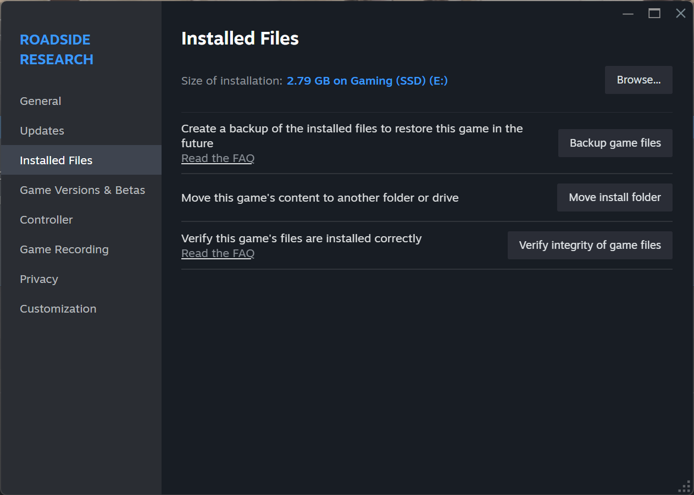

# StreamSideResearch

StreamSideResearch is a MelonLoader Unity mod for the Steam game, [Roadside Research](https://store.steampowered.com/app/3643170/Roadside_Research/).

Its primary focus is on Twitch streamers who wish to add an element of interactivity with their audience, by allowing Twitch chatters to appear in the game, either as agents or customers.

## Table of Contents

* [Prerequisites](#prerequisites)
* [Getting Started](#getting-started)
* [Configuration](#configuration)
  * [Twitch](#twitch)
    * [Blocklisted Chatters](#blocklistedchatters)
    * [Channel Name](#channelname)
    * [Message Agent Command](#messageagentcommand)
    * [Message Customer Command](#messagecustomercommand)
    * [Strict Body Preference](#strictbodypreference)
    * [Queue Size](#queuesize)
  * [UI](#ui)
    * [Height Offset](#heightoffset)
    * [Text Font Size](#textfontsize)
    * [Text Outline Width](#textoutlinewidth)
    * [Use Twitch Colors](#usetwitchcolors)
* [Questions?](#questions)

## Prerequisites

* [Roadside Research](https://store.steampowered.com/app/3643170/Roadside_Research/)
* [MelonLoader](https://melon-loader.com/#download)

## Getting Started

Before installing the mod, install [MelonLoader](#prerequisites), preferably using the official installer found on MelonLoader's website. Once MelonLoader has installed, run the game once, and wait for the main menu to appear before closing the game.

Download the latest version of StreamSideResearch from our [Releases page](https://github.com/ReservedKeyword/StreamSideResearch/releases), and drag-and-drop `StreamSideResearch-x.x.x.dll` into the `Mods` directory.

For reference, if you right-click Roadside Research in Steam, click Properties, then click on Installed Files, you should see similar to the following image. In this image, click on "Browse..." and you File Explorer will open to your game's Steam directory.



Start Roadside Research Demo again, allowing the game *and the mod* time to fully launch, before exiting the game (again) once reaching the main menu.

Proceed to the next section in this document to learn how to configure the mod!

## Configuration

The configuration file can be found in your game's `UserData` directory, with the name `StreamSideResearch.cfg`.

The path will look similar to `/path/to/game/UserData/StreamSideResearch.cfg`, where `/path/to/game` is the path to the Roadside Research game directory. (See image above on how to locate where the game was downloaded.)

The following configuration options are available:

### Twitch

#### `BlocklistedChatters`

A comma-separated, trimmed list of chatter(s) who should be ignored. This option is often used for bots, such as Fossabot, StreamElements, etc.

An example of multiple users would be as follows:

```toml
BlocklistedChatters = "Fossabot,StreamElements,Streamlabs"
```

#### `ChannelName`

The Twitch channel to join and listen for commands in.

#### `MessageAgentCommand`

The command that is used in Twitch chat to express chatter intent to be an in-game agent. This command, like `MessageCustomerCommand`, can also include an additional preference, such as `f` or `female` for female and `m` or `male` for male.

Assuming that `MessageAgentCommand` is equal to `!agent`,

```
# Will be any in-game agent
!agent

# Will be an in-game female agent
!agent f
!agent female

# Will be an in-game male agent
!agent m
!agent male
```

#### `MessageCustomerCommand`

The command that is used in Twitch chat to express chatter intent to be an in-game customer. This command, like `MessageAgentCommand`, can also include an additional preference, such as `f` or `female` for female and `m` or `male` for male.

Assuming that `MessageCustomerCommand` is equal to `!customer`,

```
# Will be any customer
!customer

# Will be a female customer
!customer f
!customer female

# Will be a male customer
!customer m
!customer male
```

#### `StrictBodyPreference`

A boolean value (`true`/`false`) that will specify how the mod behaves when the queue is exhausted.

If this value is set to `true` and an NPC spawns in the game, the mod will **only** fetch chatters who specified the body type preference that is spawning (or chatters who did not specify any body type). If no chatters with the same body type preference as the NPC are found, the mod will NOT generate and apply a name tag to the NPC.

In contrast, if this value is set to `false` and an NPC spawns in the game, the mod will attempt to find a chatter with the same body type preference as the NPC. *However*, unlike if this value is set to `true`, if a chatter with the specified body type preference is not found, then the mod, instead of failing, will fall back to any chatter that has expressed interest in the NPC type, regardless of their body type preference, as specified.

It's important to note that regardless of this value, agents and customers are ALWAYS in split pools. If a chatter expresses interest in being an agent, if no customers can be applied, the mod will never choose an agent. This value only affects body type preference.

#### `QueueSize`

The upper-amount of chatters that are allowed to be in the queue at any given time.

This value is, as mentioned previously, the upper limit. It will fluctuate as agents and customers spawn in the game and chatters are popped from the queue.

### UI

#### `HeightOffset`

The vertical offset above an NPC's head that the name tag text will appear.

#### `TextFontSize`

The font size of the text that will appear above an NPC's head.

#### `TextOutlineWidth`

The outline width of the text that will appear above an NPC's head.

#### `UseTwitchColors`

If `true`, the color of the text that will appear above an NPC's head will match the color of the chatter in Twitch, if they have one specified. If the chatter does not have a specified color, or if this value is set to `false`, the color of the text will be white.

## Questions?

If you have any questions, feel free to put them in [GitHub Issues](https://github.com/ReservedKeyword/StreamSideResearch/issues) or by email at [contact@reservedkeyword.com](mailto:contact@reservedkeyword.com).